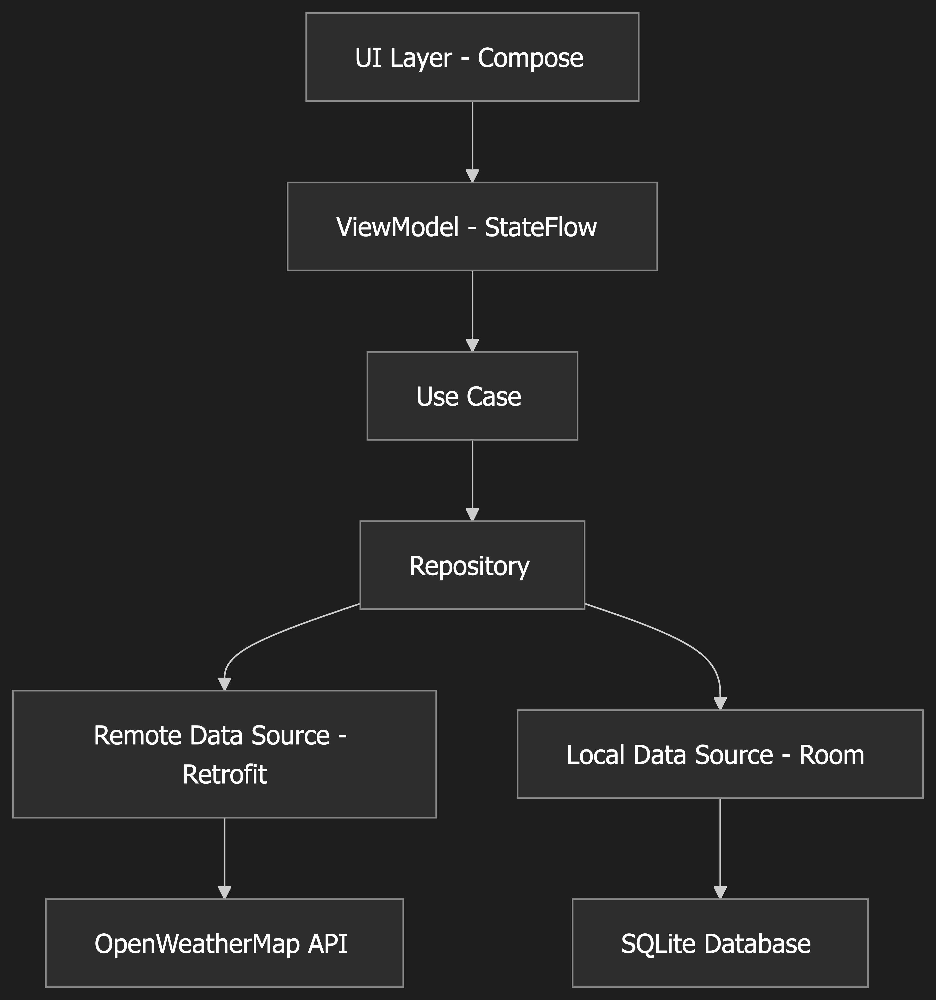

# Weather App 🌤️

A modern Android weather application built with Jetpack Compose, providing real-time weather information and forecasts using the OpenWeatherMap API.



## Features

- **Current Weather Display**: Real-time weather conditions including temperature, humidity, wind speed, and more
- **5-Day Weather Forecast**: Detailed forecast for the next 5 days
- **City Search**: Search for weather information by city name
- **Location-Based Weather**: Get weather data based on device location
- **Modern UI**: Clean and intuitive interface built with Jetpack Compose
- **Offline Support**: Local caching for better user experience
- **Multiple Languages**: Support for Indonesian and other languages

## Tech Stack

### Architecture
- **MVVM (Model-View-ViewModel)**: Clean architecture pattern
- **Repository Pattern**: Separation of data access logic
- **Dependency Injection**: Hilt for dependency management

### UI & Presentation
- **Jetpack Compose**: Modern declarative UI toolkit
- **Material Design 3**: Latest Material Design components
- **Navigation Component**: For screen navigation
- **Coil**: Image loading for weather icons

### Data & Networking
- **Retrofit**: REST API client
- **OkHttp**: HTTP client with logging interceptor
- **Gson**: JSON serialization/deserialization
- **Room Database**: Local data persistence
- **DataStore**: Preferences storage

### Background Processing
- **Coroutines**: Asynchronous programming
- **Flow**: Reactive data streams

## Architecture Overview

```
app/
├── data/
│   ├── local/          # Room database, DAOs
│   ├── remote/         # API services, DTOs, mappers
│   └── repository/     # Repository implementations
├── domain/
│   ├── model/          # Domain models
│   ├── repository/     # Repository interfaces
│   └── usecase/        # Use cases
├── presentation/
│   ├── component/      # Reusable UI components
│   ├── screen/         # Screens
│   └── viewmodel/      # ViewModels
├── di/                 # Dependency injection modules
└── utils/              # Utility classes
```

## Setup Instructions

### Prerequisites
- Android Studio Arctic Fox or later
- JDK 11 or later
- Android SDK (minimum API 24)

### API Key Setup
1. Get your free API key from [OpenWeatherMap](https://openweathermap.org/api)
2. Replace `YOUR_API_KEY_HERE` in [`WeatherApiService.kt`](app/src/main/java/com/hadsxdev/weather/data/remote/api/WeatherApiService.kt:13) with your actual API key

### Build Instructions
1. Clone the repository
2. Open the project in Android Studio
3. Sync the project with Gradle files
4. Build and run the app

## Key Components

### Weather API Service
- Base URL: `https://api.openweathermap.org/data/2.5/`
- Supports both city name and coordinate-based queries
- Returns current weather and 5-day forecast data

### Main Features
- **Current Weather**: Temperature, feels like, humidity, pressure, wind speed, visibility
- **Forecast**: 5-day forecast with daily temperature ranges
- **Search**: City search functionality
- **Location**: GPS-based weather data

## Dependencies

```kotlin
// Core Android
implementation("androidx.core:core-ktx:1.12.0")
implementation("androidx.compose.material3:material3:1.1.2")

// Networking
implementation("com.squareup.retrofit2:retrofit:2.9.0")
implementation("com.squareup.okhttp3:okhttp:4.12.0")

// Dependency Injection
implementation("com.google.dagger:hilt-android:2.48")
kapt("com.google.dagger:hilt-compiler:2.48")

// Database
implementation("androidx.room:room-runtime:2.6.0")
implementation("androidx.room:room-ktx:2.6.0")

// Location
implementation("com.google.android.gms:play-services-location:21.0.1")
```

## Permissions

The app requires the following permissions:
- `INTERNET`: For network access
- `ACCESS_NETWORK_STATE`: To check network connectivity
- `ACCESS_COARSE_LOCATION`: For approximate location
- `ACCESS_FINE_LOCATION`: For precise location

## Future Enhancements

- [ ] Weather alerts and notifications
- [ ] Multiple city management
- [ ] Weather maps integration
- [ ] Air quality information
- [ ] Weather widgets
- [ ] Dark mode support
- [ ] Unit conversion (Celsius/Fahrenheit)
- [ ] Weather history data

## Contributing

1. Fork the repository
2. Create your feature branch (`git checkout -b feature/amazing-feature`)
3. Commit your changes (`git commit -m 'Add some amazing feature'`)
4. Push to the branch (`git push origin feature/amazing-feature`)
5. Open a Pull Request

## License

This project is licensed under the MIT License - see the LICENSE file for details.

## Author

**HadsxDev** - Android Developer

---

Built with ❤️ using Jetpack Compose and modern Android development practices.